# PPT Agent

基于 [Claude Code](https://docs.anthropic.com/en/docs/claude-code) 的多智能体 PPT 幻灯片生成工作流。

由 Claude 生成 + Gemini 审查，输出 SVG 1280×720 Bento Grid 布局的演示幻灯片。

## 效果展示

> `/ppt-agent:ppt 帮我收集一下新一代小米su7的发布会资料然后做一套PPT`

| | | |
|:---:|:---:|:---:|
| 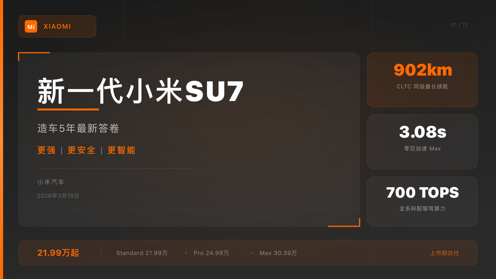 | 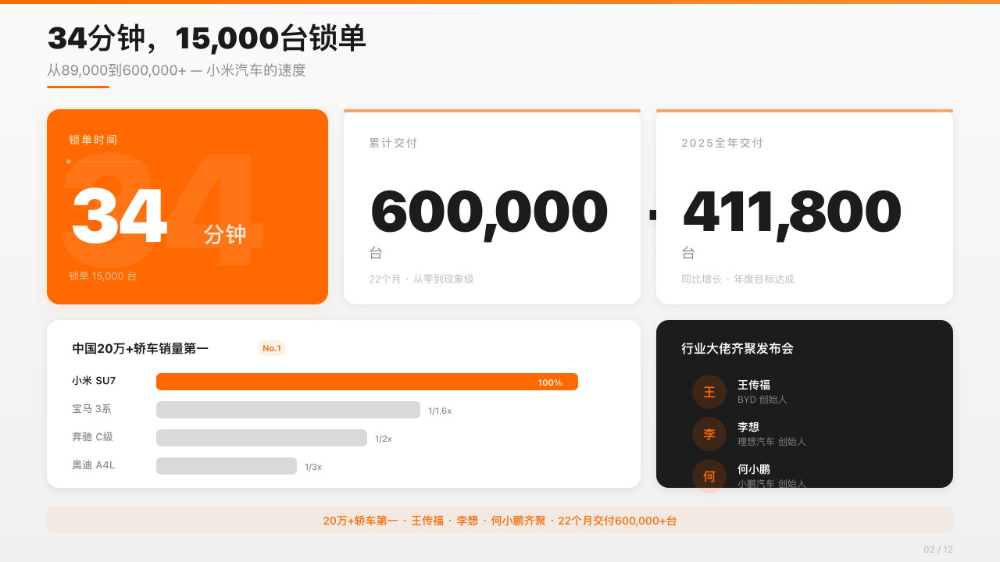 | 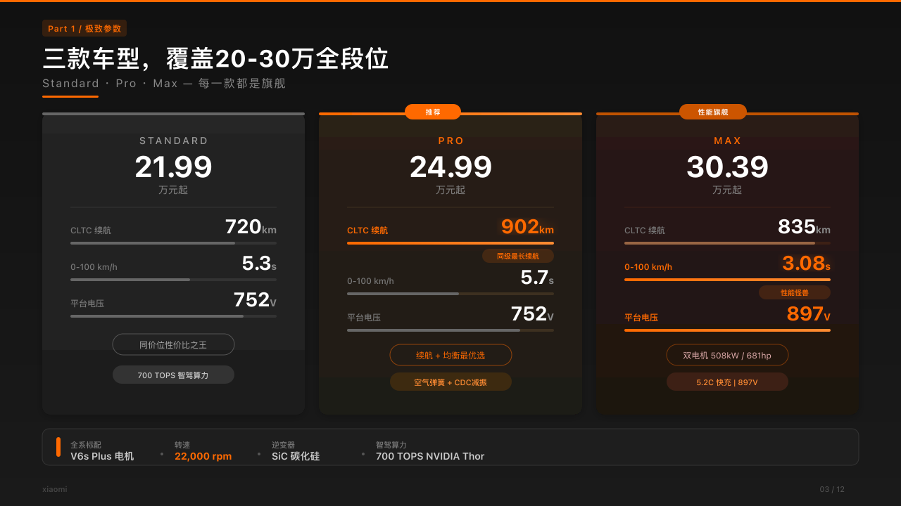 |
| 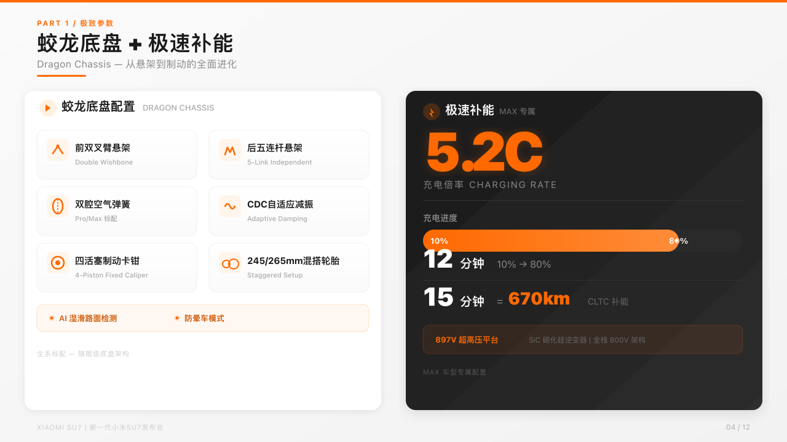 | 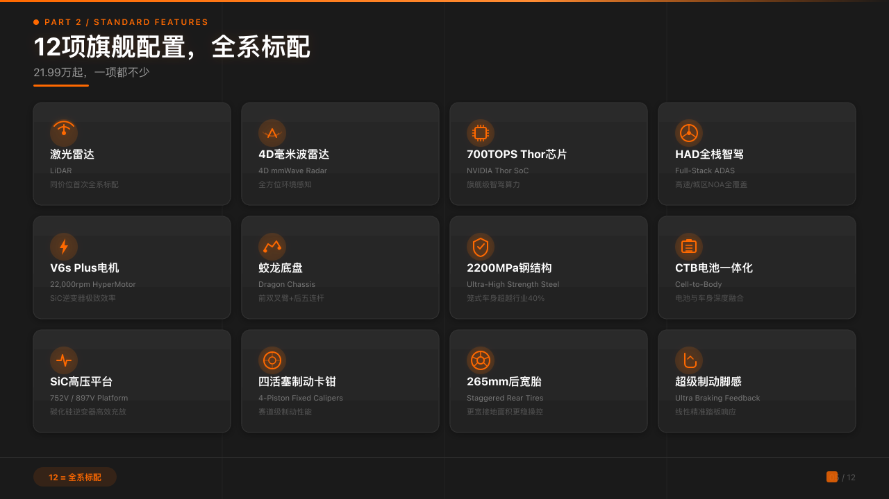 | 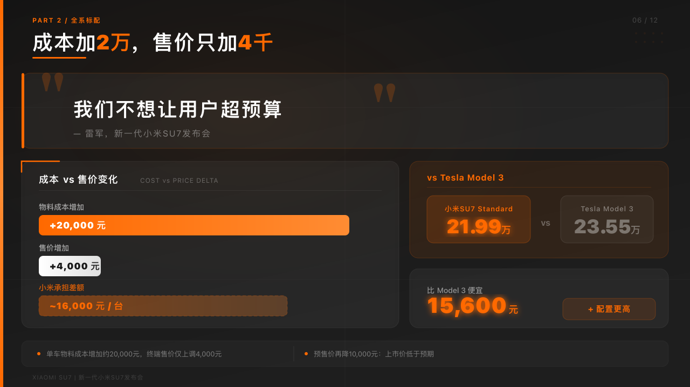 |
| 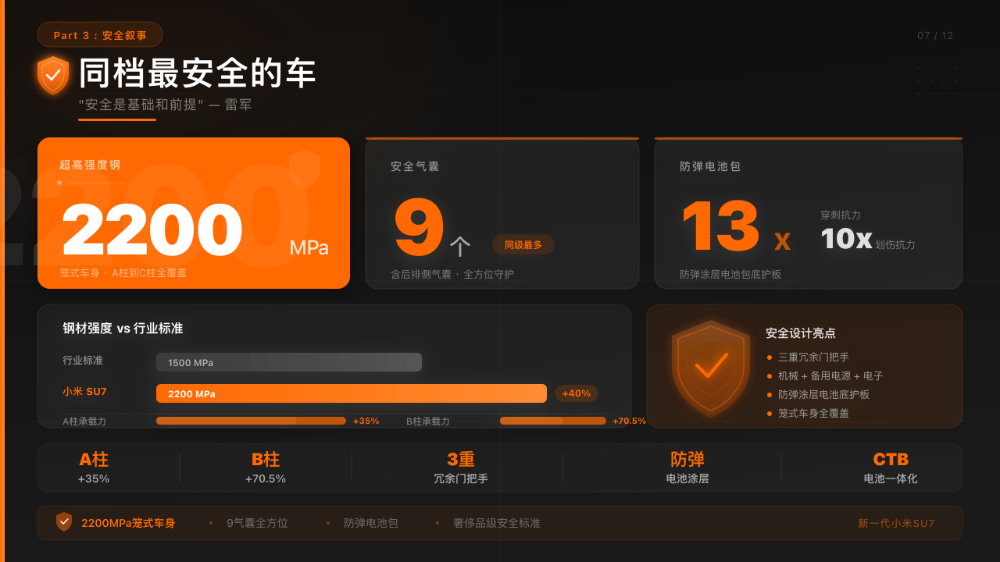 | 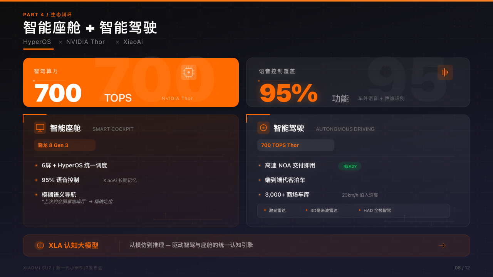 | 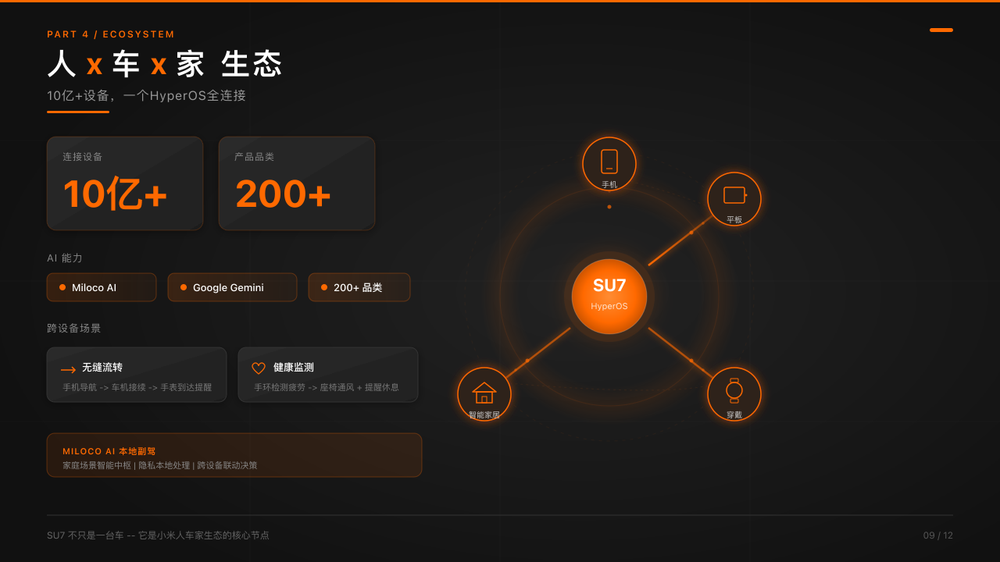 |
| 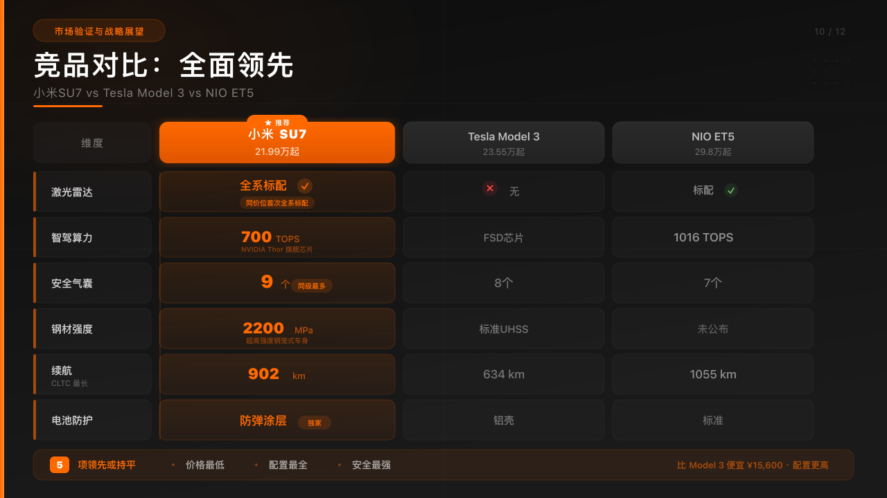 | 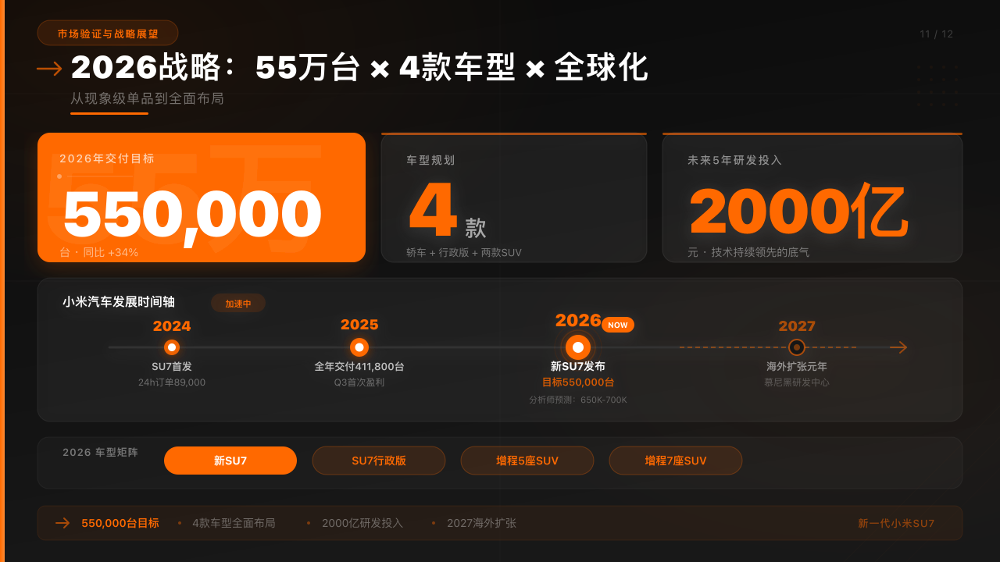 |  |

## 安装

```bash
claude plugin marketplace add zengwenliang416/ppt-agent
claude plugin install ppt-agent
```

## 使用

```
/ppt-agent:ppt <主题或需求描述>
```

## 工作流程

1. **初始化** — 解析参数，创建运行目录
2. **需求调研** — 背景搜索 + 用户确认需求
3. **素材收集** — 按章节并行深度搜索
4. **大纲规划** — 金字塔原理结构化大纲 + 用户审批
5. **规划草稿** — 每页生成简版 SVG 草稿
6. **设计稿 + 审查** — Bento Grid SVG 生成 + Gemini 质量审查循环
7. **交付** — 最终 SVG 文件 + 交互式 HTML 预览页

## 智能体

| 智能体 | 职责 |
|--------|------|
| `research-core` | 需求调研 + 素材收集 |
| `content-core` | 大纲规划 + 规划草稿 |
| `slide-core` | 设计 SVG 生成（Bento Grid 布局） |
| `review-core` | Gemini 驱动的 SVG 质量审查 |

## 输出目录

```
openspec/changes/<run_id>/
├── research-context.md      # 调研上下文
├── requirements.md          # 需求文档
├── materials.md             # 素材汇总
├── outline.json             # 结构化大纲
├── drafts/slide-{nn}.svg    # 规划草稿
├── slides/slide-{nn}.svg    # 设计稿
├── reviews/review-{nn}.md   # 审查报告
└── output/
    ├── slide-{nn}.svg       # 最终 SVG
    └── index.html           # 交互式预览页
```

## 许可证

MIT
